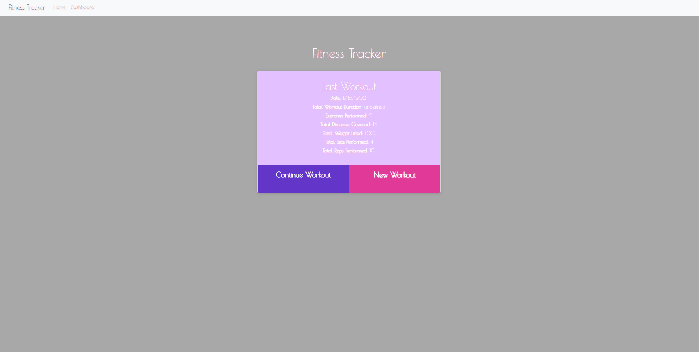

# FitnessTracker
## Description
Add cardio and resistance workouts and keep track of days worked out, time worked out, and total workouts.

Use the deployed application [here.](https://desolate-wave-23345.herokuapp.com/)
## Table of Contents
* [Title](#title)
* [Description](#description)
* [Table of Contents](#table-of-contents)
* [Deploy](#installation-instructions)
* [Usage](#usage)
* [Contributing](#want-to-contribute?)
* [Licensing](#licensing)
* [Questions/Contact Me](#questions/contact-me)

### How to Deploy Application
By using the deployed application [here!](https://desolate-wave-23345.herokuapp.com/)

### Want to Contribute? 
Emailing me at BreadBooks99@gmail.com

### Licensing

[MIT](https://choosealicense.com/licenses/mit).

### Questions/Contact Me
View my GitHub portfolio [Here](https://github.com/BreadBooks)

[Email Me!](mailto:BreadBooks99@gmail.com)

Thank you! :cherry_blossom: